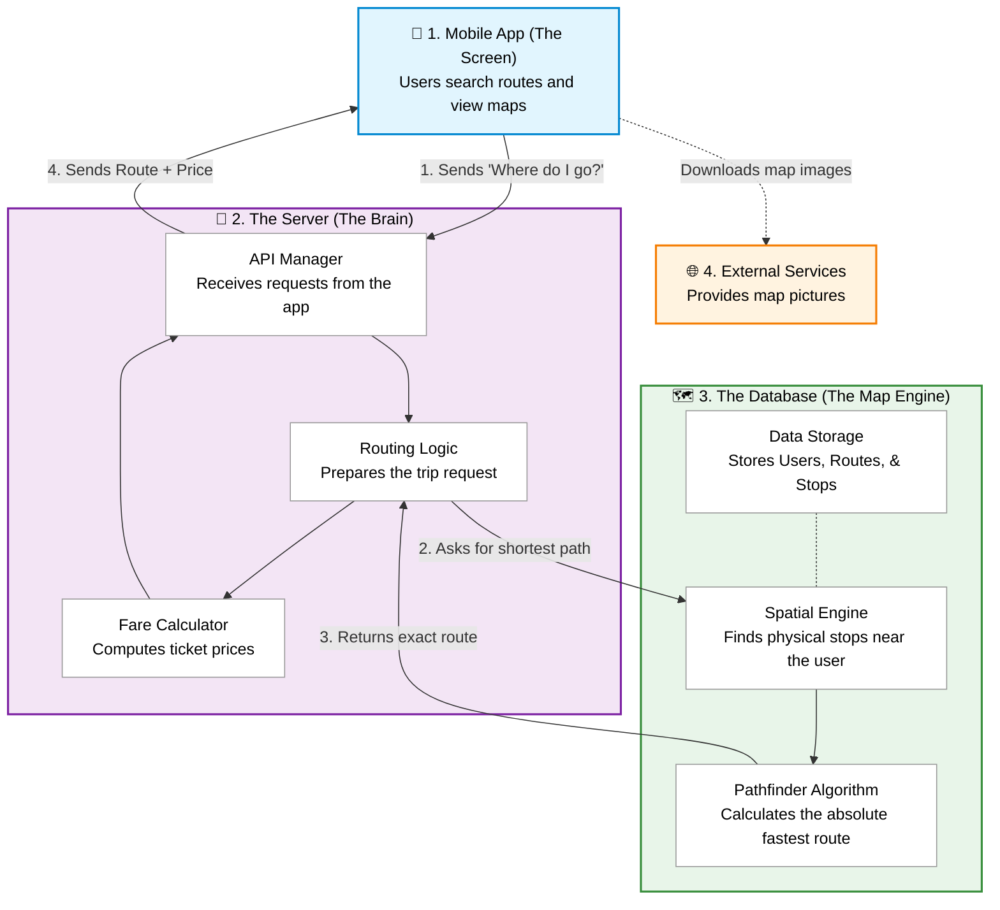
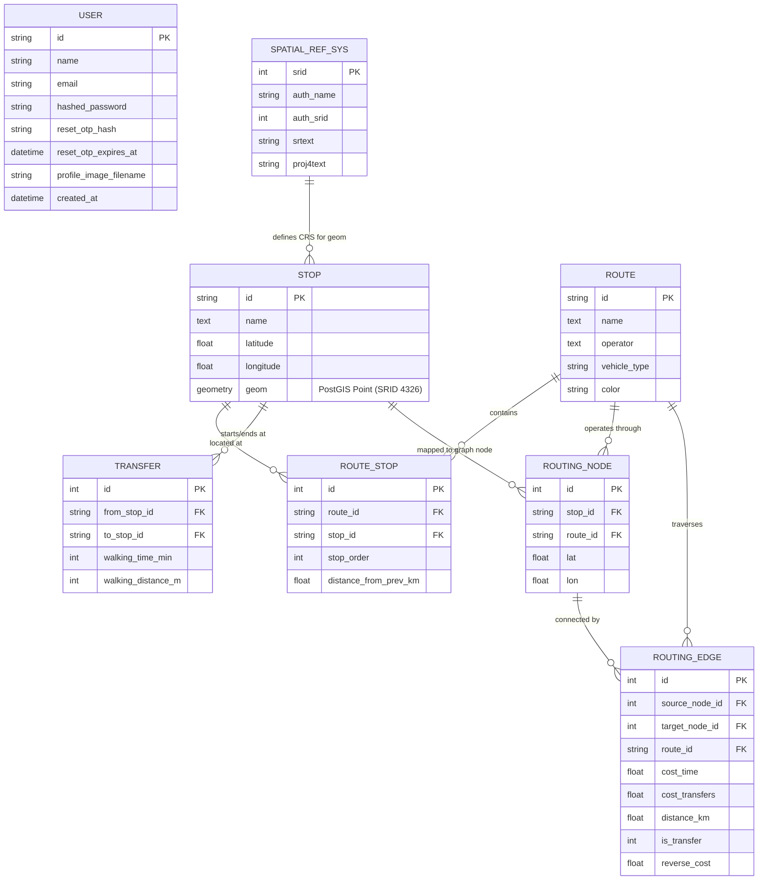
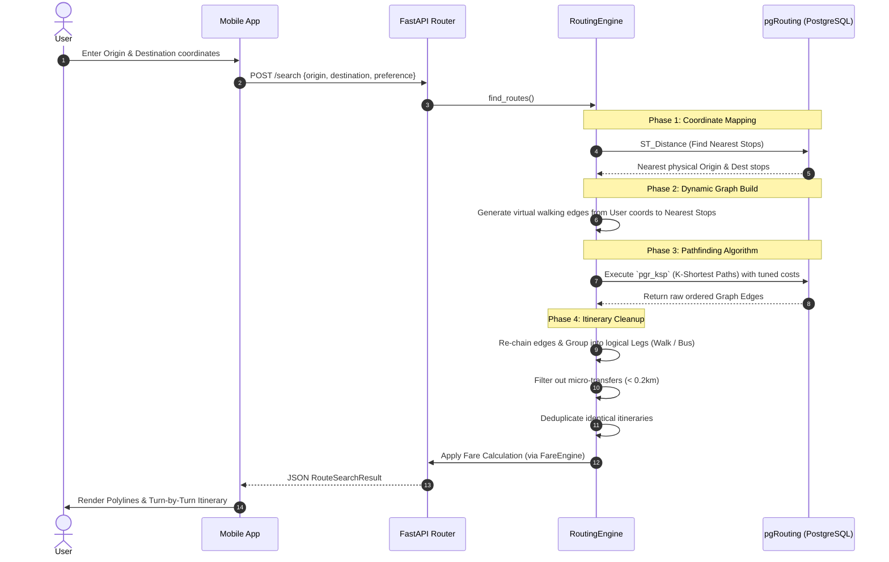
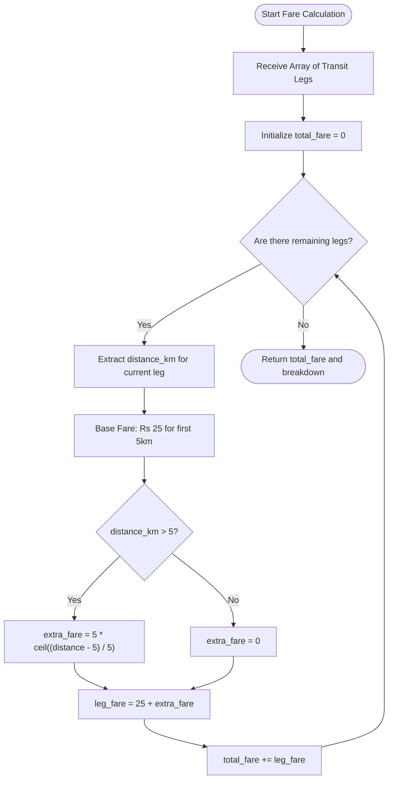
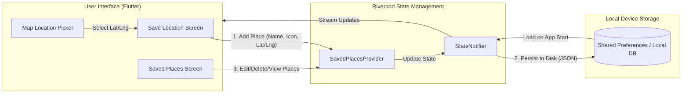
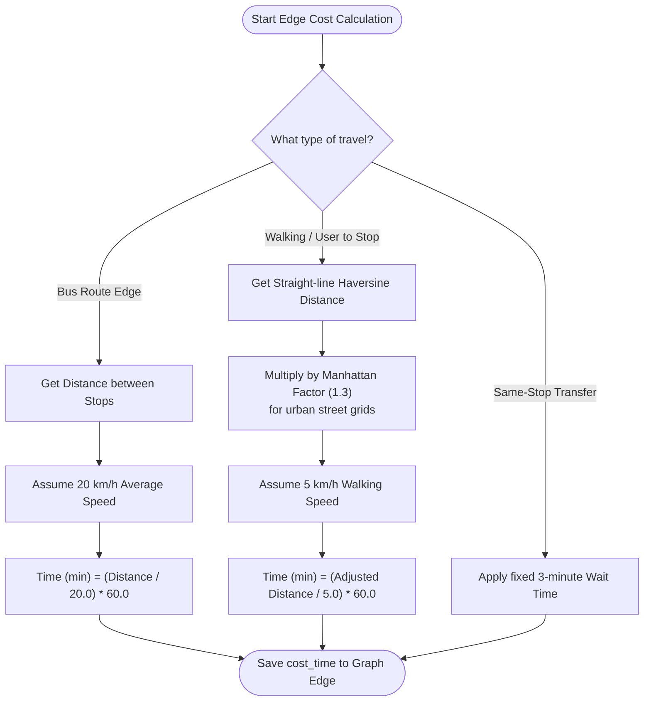

# Sajilo Yatra Comprehensive Architecture Analysis

This document outlines the core technical architecture, data structures, and operational flows of the Sajilo Yatra platform. The diagrams have been redesigned for maximum clarity and understanding.

## 1. System Architecture

The overarching system architecture separates the mobile frontend from the data-heavy spatial backend and database systems.

> [!NOTE]
> **How to explain this:** The user opens the **App** and asks for a route. The **API Manager** inside the Server receives this and hands it to the **Routing Logic**. The Routing Logic asks the Database's **Spatial Engine** to find the closest physical bus stops, and then the **Pathfinder Algorithm** computes the fastest way between them. Once the route is found, it is sent back to the Server where the **Fare Calculator** figures out the price. Finally, the API Manager sends the complete itinerary back to the user's phone.

---

## 2. Entity-Relationship (ER) Diagram

The database schema cleanly separates user data from transit routing graph data.

---

## 3. Route Search & Graph Pathfinding Flow

How the system maps user coordinates to graph nodes and extracts human-readable itineraries using pgRouting.

---

## 4. Fare Calculation Engine Flow

The backend dynamically computes fares based on Nepal's transit distance rules.

> [!TIP]
> **Fare Logic Rule:** The algorithm applies a base fare of Rs 25 for the first 5 kilometers. For every additional 5 kilometers (or fraction thereof), an extra Rs 5 is added to the leg's fare. Transfers mean the fare resets for the next leg.

---

## 5. Authentication & Password Reset Flow

The secure JWT-based authentication system handles login, registration, and email-based OTP password resets.

```mermaid
sequenceDiagram
    actor User
    participant App as Mobile App
    participant Auth as FastAPI Auth Router
    participant DB as PostgreSQL
    participant SMTP as SMTP Server (Email)

    %% Login Flow
    rect rgb(24, 30, 40)
        Note over User,DB: Login Flow
        User->>App: Submits Email & Password
        App->>Auth: POST /login
        Auth->>DB: Query User by Email
        DB-->>Auth: User Record (Hashed Password)
        Auth->>Auth: Verify Bcrypt Hash
        Auth-->>App: Return JWT Access Token
    end

    %% Forgot Password Flow
    rect rgb(30, 24, 40)
        Note over User,SMTP: Password Reset Flow
        User->>App: Request Password Reset (Email)
        App->>Auth: POST /forgot-password
        Auth->>DB: Check if Email exists
        Auth->>Auth: Generate 6-digit OTP & Hash it
        Auth->>DB: Save OTP Hash & Expiry (15 mins)
        Auth->>SMTP: Send OTP via Email
        SMTP-->>User: Delivers Email with OTP
        Auth-->>App: Status 202 Accepted
    end

    %% Reset Action
    rect rgb(24, 40, 30)
        Note over User,DB: Execute Password Reset
        User->>App: Submit OTP + New Password
        App->>Auth: POST /reset-password
        Auth->>DB: Fetch User & OTP Hash
        Auth->>Auth: Validate OTP Hash & Expiry Time
        Auth->>Auth: Hash New Password (Bcrypt)
        Auth->>DB: Update Password, Clear OTP fields
        Auth-->>App: Status 200 OK (Password Updated)
    end
```

---

## 6. Saved Places Module Flow

The Saved Places module operates entirely client-side, persisting favorite locations (Home, Work, etc.) to local device storage using Riverpod providers.

> [!IMPORTANT]
> Saved Places are stored locally on the user's device and do not sync to the backend database. This ensures privacy for user locations and provides immediate offline access to favorite coordinates for routing.

---

## 7. Travel Time Calculation Flow

Travel time is calculated dynamically during the graph generation (`build_pgrouting_graph.py`) and routing phases based on assumed speeds for different modes of transportation.

> [!NOTE]
> **Nuisance Penalty:** When sorting for the "shortest" route, the algorithm injects a hidden 3-minute penalty for every transfer to discourage the router from suggesting chaotic multi-bus itineraries just to save a few seconds. This penalty is only used for sorting and is omitted from the final displayed time.
